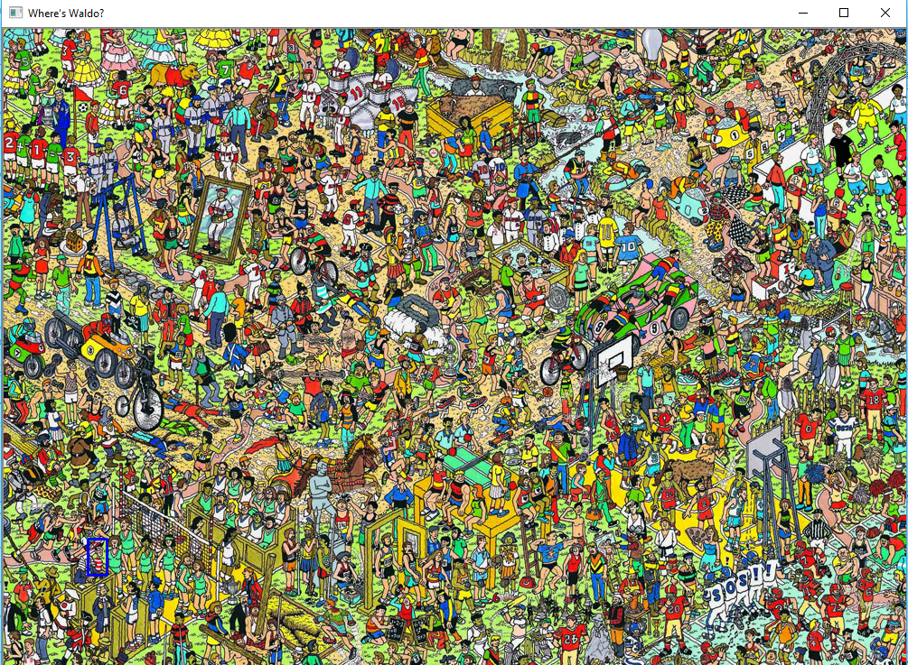

# templateMatchWheresWaldo

Script uses template matching to find Waldo in a Where's Waldo game. It outlines Waldo with a blue rectangle. In the below example, Waldo is found in the lower left section of the image.

